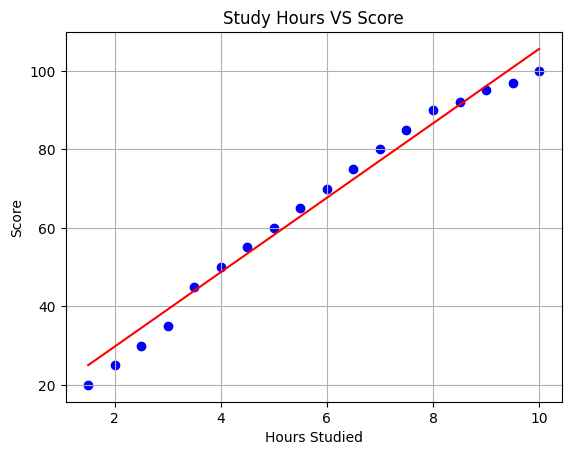

# 🎓 Student Score Predictor — Linear Regression Project

This beginner-friendly machine learning project uses **Simple Linear Regression** to predict a student's exam score based on the number of hours studied. It’s built with Python and Kaggle's Jupyter Notebook environment using `pandas`, `matplotlib`, and `scikit-learn`.

> 💡 "What if you could predict your exam score just by logging your study hours?"

---

## 📁 Dataset Overview

- **Source**: Manually uploaded CSV file on Kaggle
- **Attributes**:
  - `Hours`: Number of hours studied per day
  - `Scores`: Corresponding exam scores

---

## 🔧 Tech Stack

| Tool             | Purpose                          |
|------------------|----------------------------------|
| Python 3         | Core programming language        |
| pandas           | Data manipulation & cleaning     |
| matplotlib       | Data visualization               |
| scikit-learn     | Model training & evaluation      |
| Jupyter Notebook | Kaggle notebook environment      |
| GitHub           | Project hosting & documentation  |

---

## 📊 Project Workflow

### 1. 📥 Load & Visualize Data
- Import CSV
- Create a scatter plot (Hours vs Scores)

### 2. 🧪 Preprocess
- Check for nulls
- Reshape data if needed

### 3. 📚 Train-Test Split
- 80% training, 20% testing using `train_test_split()`

### 4. 🧠 Train the Model


---

## 📈 5. Visualize Regression Line

This plot shows how well the model fits the data:

- 🔵 **Blue dots** = Actual data points  
- 🔴 **Red line** = Model's predicted regression line


---

## 🎯 6. Predict on New Data

Use your trained model to predict the score for a student who studied **6.5 hours**:

```python
model.predict([[6.5]])
## 🔮 Sample Prediction

```python
# Input: 6.5 hours studied
predicted_score = model.predict([[6.5]])
```
---

## 📚 Prediction Result

🧠 **Predicted Score for 6.5 Hours of Study**:  ~72.98 marks


---

## 📐 Model Evaluation

| Metric                  | Value   | Meaning                                        |
|-------------------------|---------|------------------------------------------------|
| 📉 Mean Absolute Error  | 3.29    | Average error between actual & predicted       |
| 🔢 Mean Squared Error   | 13.49   | Penalizes larger errors more                   |
| 📊 R² Score (Accuracy)  | 0.96 ✅ | Model explains **96%** of the variance in data |

> ✅ **Excellent fit!** Only ~4% variance remains unexplained.

---

## 📎 Files Included

| File Name                        | Description                                |
|----------------------------------|--------------------------------------------|
| `student_scores.csv`             | Dataset used in this project               |
| `student-score-predictor.ipynb`  | Full Kaggle notebook with all the code     |
| `plot.png`                       | Graph showing regression line + data       |
| `README.md`                      | You’re reading it now! 📖                  |

---


